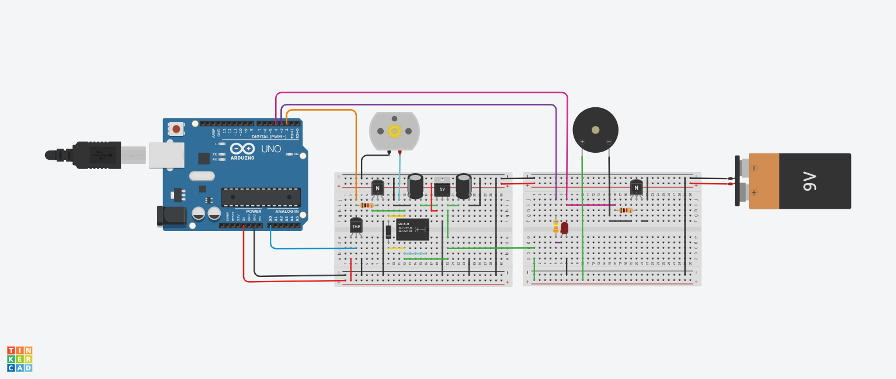

# Controle de Temperatura com TMP36 e Arduino
Este projeto monitora a temperatura ambiente usando um sensor LM35 e controla um cooler (ventoinha) para resfriar um sistema quando a temperatura atinge 30°C. O circuito também possui um LED e um buzzer que alertam quando a temperatura atinge um nível crítico de 50°C.

### Componentes
Name	           Quantity	    Component
UArduinoBoard     	1	        Arduino Uno R3
U1                	1	        Temperature Sensor [TMP36]
K1	                1	        Relay SPDT
M1	                1	        DC Motor
BAT1	              1	        9V Battery
D6	                1	        Diode
T1, T2            	2	        NPN Transistor (BJT)
R6, R8	            2	        1 kΩ Resistor
U5                	1	        5V Regulator [LM7805]
C1	                1	        10 uF, 16 V Polarized Capacitor
C2	                1	        0.1 uF, 16 V Polarized Capacitor
PIEZO1	            1	        Piezo
D1                	1	        Red LED
R7                	1	        330 kΩ Resistor

### Diagrama de Circuito

  
